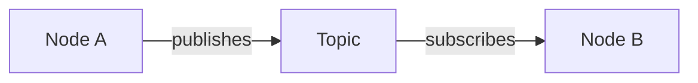

# Chapter Format Skill

**Version:** 1.0
**Purpose:** Define the exact structure every chapter in the Physical AI & Humanoid Robotics textbook must follow
**Audience:** All content subagents (ROS2_Content_Expert, Gazebo_Expert, Isaac_Expert, VLA_Expert, Chatbot_Expert)

---

## Overview

This skill ensures every chapter maintains consistent structure, formatting, tone, and quality. Use this as your checklist when creating or reviewing any textbook chapter.

---

## 1. File Naming Convention

### Rules
- **Format**: `##-topic-name.md`
- **Numbering**: Two-digit prefix (01, 02, 03, ..., 99)
- **Separator**: Single hyphen after number
- **Style**: kebab-case for topic names (lowercase, hyphens between words)
- **Extension**: `.md` (Markdown)

### Examples
✅ **Correct**:
- `01-introduction-to-ros2.md`
- `02-ros2-nodes.md`
- `03-topics-and-publishers.md`
- `15-advanced-navigation-techniques.md`

❌ **Incorrect**:
- `1-introduction.md` (single digit)
- `01_introduction.md` (underscore instead of hyphen)
- `01-Introduction-To-ROS2.md` (capital letters)
- `chapter-01-introduction.md` (prefix word)

### Location
All chapters reside in: `docs/module-#/` (where # is the module number)

Example: `docs/module-1/01-introduction-to-ros2.md`

---

## 2. Frontmatter Template

### Required Frontmatter
Every chapter MUST start with YAML frontmatter between `---` delimiters:

```yaml
---
sidebar_position: [number]
title: "[Chapter Title]"
description: "[One-line description for SEO and previews]"
---
```

### Field Specifications

| Field | Type | Description | Example |
|-------|------|-------------|---------|
| `sidebar_position` | Integer | Matches file number prefix | `1` (for `01-*.md`) |
| `title` | String (quoted) | Human-readable chapter title | `"Introduction to ROS 2"` |
| `description` | String (quoted) | 10-20 word summary for SEO | `"Learn what ROS 2 is and why it's essential for modern robotics"` |

### Complete Example
```yaml
---
sidebar_position: 1
title: "Introduction to ROS 2"
description: "Learn what ROS 2 is, why it matters, and run your first robot node"
---
```

### Validation Rules
- `sidebar_position` must match the file number (file `03-*.md` → `sidebar_position: 3`)
- `title` uses Title Case for major words
- `description` is a complete sentence or phrase (no period at end)
- All fields are required (no optional frontmatter)

---

## 3. Required Sections (In Order)

Every chapter MUST include these 9 sections in this exact order:

### Section Checklist
1. ✅ **Title (H1)**
2. ✅ **Learning Objectives**
3. ✅ **Introduction**
4. ✅ **Core Concepts**
5. ✅ **Practical Examples**
6. ✅ **Hands-on Exercise**
7. ✅ **Common Pitfalls**
8. ✅ **Summary**
9. ✅ **Further Reading**

---

### 3.1 Title (H1)

**Format**:
```markdown
# [Chapter Title]
```

**Rules**:
- Exactly one H1 per chapter
- Must match the `title` field in frontmatter
- No emoji, no trailing punctuation
- Title Case for major words

**Example**:
```markdown
# Introduction to ROS 2
```

---

### 3.2 Learning Objectives

**Header**:
```markdown
## Learning Objectives
```

**Format**: Bullet list with 3-5 specific, measurable objectives

**Structure**: Each objective starts with an action verb and describes what the student will be able to DO after completing the chapter.

**Action Verbs to Use**:
- **Understand**: explain, describe, identify, recognize
- **Create**: build, write, implement, develop
- **Apply**: use, demonstrate, execute, configure
- **Analyze**: debug, troubleshoot, compare, differentiate
- **Evaluate**: assess, choose, justify, validate

**Template**:
```markdown
## Learning Objectives

By the end of this chapter, you will be able to:

- [Action verb] [specific outcome] [context/constraint]
- [Action verb] [specific outcome] [context/constraint]
- [Action verb] [specific outcome] [context/constraint]
- [Action verb] [specific outcome] [context/constraint]
- [Action verb] [specific outcome] [context/constraint]
```

**Example**:
```markdown
## Learning Objectives

By the end of this chapter, you will be able to:

- Explain what ROS 2 is and why it's used in modern robotics systems
- Identify the key components of ROS 2 architecture (nodes, topics, middleware)
- Create and run a simple "Hello World" ROS 2 node using Python
- Describe the differences between ROS 1 and ROS 2 (optional context)
- Navigate official ROS 2 documentation to find package references
```

**Validation**:
- [ ] 3-5 objectives (no fewer, no more)
- [ ] Each starts with action verb
- [ ] Each is specific and measurable
- [ ] No vague objectives like "learn about" or "understand concepts"

---

### 3.3 Introduction

**Header**:
```markdown
## Introduction
```

**Length**: 200-300 words

**Purpose**:
- Hook the reader with a relatable scenario or question
- Explain WHY this chapter matters
- Preview WHAT will be covered
- Build motivation and context

**Structure**:
1. **Hook** (1-2 sentences): Start with analogy, real-world scenario, or compelling question
2. **Why it matters** (2-3 sentences): Connect to larger goals (building robots, understanding systems)
3. **What you'll learn** (2-3 sentences): Preview key concepts without detail
4. **Prerequisites** (1 sentence, if applicable): State required prior knowledge

**Tone Guidelines**:
- Conversational yet professional
- Use "you" to address reader directly
- Encouraging and welcoming
- Avoid jargon (or define it immediately)

**Template**:
```markdown
## Introduction

[Hook: Analogy, scenario, or question]

[Why this matters: Connect to real robotics applications]

[What you'll learn: Preview the key concepts]

[Prerequisites: "Before diving in, make sure you've completed Chapter X..."]
```

**Example**:
```markdown
## Introduction

Imagine trying to build a robot where the camera, motor controller, and decision-making AI all had to run in a single massive program. Every time you wanted to add a sensor, you'd need to rewrite core logic. This approach doesn't scale—and it's exactly why ROS 2 exists.

ROS 2 (Robot Operating System 2) is a middleware framework that lets different parts of your robot communicate seamlessly, even if they're written in different languages or running on different computers. Whether you're building a warehouse robot, a self-driving car, or a humanoid assistant, ROS 2 provides the "nervous system" that connects sensors, actuators, and intelligence.

In this chapter, you'll learn what ROS 2 is, why it replaced ROS 1, and how its architecture enables modular robotics development. You'll run your first ROS 2 node and see messages flowing between processes. By the end, you'll understand why ROS 2 is the industry standard for physical AI systems.

Before diving in, make sure you have basic Python knowledge and familiarity with command-line interfaces.
```

**Validation**:
- [ ] 200-300 words
- [ ] Answers "Why should I care?"
- [ ] Previews chapter content
- [ ] No unexplained jargon
- [ ] Welcoming tone

---

### 3.4 Core Concepts

**Header**:
```markdown
## Core Concepts
```

**Length**: 500-800 words

**Purpose**: Teach the fundamental ideas, definitions, and mental models needed to understand the topic.

**Structure**:
- Use **H3 subheadings** (`###`) for each major concept
- Present concepts in order of increasing complexity
- Define technical terms **on first use** with bold formatting
- Use analogies before technical definitions (Constitution Principle I)
- Include Mermaid diagrams for abstract concepts

**Concept Presentation Pattern**:
1. **Analogy/Real-world comparison** (1-2 sentences)
2. **Technical definition** (1-2 sentences, bold key term)
3. **How it works** (2-4 sentences with details)
4. **Why it matters** (1-2 sentences connecting to larger picture)
5. **Visual aid** (Mermaid diagram if concept is abstract)

**Template**:
```markdown
## Core Concepts

### [Concept 1 Name]

[Analogy or real-world comparison]

**[Technical term]** is [definition]. [How it works in 2-3 sentences].

[Why this matters for robotics/the bigger picture]

[Optional: Mermaid diagram]

### [Concept 2 Name]

[Repeat pattern]

### [Concept 3 Name]

[Repeat pattern]
```

**Example**:
```markdown
## Core Concepts

### What is ROS 2?

Think of ROS 2 as the postal service for your robot. Just like mail carriers deliver letters between houses without each house needing to know the internal layout of others, ROS 2 delivers messages between different parts of your robot without tight coupling.

**ROS 2 (Robot Operating System 2)** is a middleware framework that provides communication infrastructure, hardware abstraction, and development tools for robotics applications. Unlike traditional operating systems, ROS 2 sits *above* Linux/Windows and provides standardized ways for robot components to discover each other and exchange data.

At its core, ROS 2 uses a publish-subscribe pattern where **nodes** (independent processes) communicate via **topics** (named message channels). This decoupled architecture means you can swap out a simulated camera for a real one without changing navigation code—they both publish to the same `/camera/image` topic.

This modularity is why companies like NASA, BMW, and Boston Dynamics use ROS 2 for everything from Mars rovers to factory automation.

```mermaid
graph LR
    A[Camera Node] -->|publishes image| B[/camera/image topic]
    B -->|subscribes| C[Vision AI Node]
    C -->|publishes command| D[/cmd_vel topic]
    D -->|subscribes| E[Motor Controller]
```

### Nodes: The Building Blocks

[Continue with next concept...]
```

**Diagram Guidelines**:
- Every abstract concept (pub/sub, request/response, state machines) MUST have a Mermaid diagram
- Use flowcharts for architecture, sequence diagrams for interactions, state diagrams for lifecycles
- Include descriptive captions below diagrams
- Keep diagrams simple (5-8 elements max)

**Validation**:
- [ ] 500-800 words
- [ ] 3-5 major concepts covered
- [ ] H3 subheadings for each concept
- [ ] Technical terms bold on first use
- [ ] Analogies before definitions
- [ ] At least 1 Mermaid diagram
- [ ] Progressive complexity (simple → advanced)

---

### 3.5 Practical Examples

**Header**:
```markdown
## Practical Examples
```

**Purpose**: Provide 2-3 complete, runnable code examples demonstrating chapter concepts.

**Quantity**:
- Minimum: 2 examples per chapter
- Ideal: 3 examples per chapter
- Maximum: 4 examples (avoid overwhelming beginners)

**Example Structure** (for EACH example):

```markdown
### Example [Number]: [Descriptive Title]

**Objective**: [What this example demonstrates in 1 sentence]

**Prerequisites**:
- [Required packages/installations]
- [Required prior knowledge]

#### Code

```[language]
[Complete, runnable code with inline comments every 3-5 lines]
```

#### How to Run

```bash
# Step 1: [Installation command with explanation]
[command]

# Step 2: [Execution command]
[command]

# Step 3: [Verification command]
[command]
```

#### Expected Output

```
[Exact output the student should see]
```

#### Explanation

[2-4 sentences explaining key parts of the code, highlighting non-obvious logic]

**Key Takeaway**: [1 sentence summarizing what this example taught]
```

**Code Quality Standards**:
- **Language identifier**: Always specify (e.g., ` ```python `, ` ```bash `, ` ```xml `)
- **Comments**: Inline comment every 3-5 lines explaining non-obvious logic
- **PEP 8 compliance**: Python code must pass `black` formatter
- **Error handling**: Include try/except for common failure modes
- **Version specifications**: Mention ROS 2 Humble, Python 3.10+, package versions

**Complete Example (Full Template)**:
```markdown
## Practical Examples

### Example 1: Minimal "Hello World" ROS 2 Node

**Objective**: Create the simplest possible ROS 2 node that prints a message, demonstrating node initialization and logging.

**Prerequisites**:
- ROS 2 Humble installed and sourced (`source /opt/ros/humble/setup.bash`)
- Basic Python knowledge

#### Code

```python
#!/usr/bin/env python3
import rclpy
from rclpy.node import Node

class HelloWorldNode(Node):
    """
    Minimal ROS 2 node that logs a greeting message.
    Demonstrates node initialization and rclpy logging.
    """
    def __init__(self):
        # Initialize the node with name 'hello_world'
        super().__init__('hello_world')

        # Log an info message (appears in terminal)
        self.get_logger().info('Hello, ROS 2 World!')

def main(args=None):
    # Initialize the ROS 2 Python client library
    rclpy.init(args=args)

    # Create an instance of our node
    node = HelloWorldNode()

    # Keep the node running (Ctrl+C to exit)
    rclpy.spin(node)

    # Clean shutdown
    node.destroy_node()
    rclpy.shutdown()

if __name__ == '__main__':
    main()
```

#### How to Run

```bash
# Step 1: Save the code to a file
echo "[paste code above]" > hello_world.py

# Step 2: Make it executable
chmod +x hello_world.py

# Step 3: Run the node
python3 hello_world.py
```

#### Expected Output

```
[INFO] [1638360000.123456789] [hello_world]: Hello, ROS 2 World!
```

Press `Ctrl+C` to stop the node.

#### Explanation

This example demonstrates the minimal structure of a ROS 2 Python node. The `Node` class from `rclpy` provides core functionality like logging (`get_logger()`). The `rclpy.spin()` function keeps the node alive, listening for callbacks until you interrupt it. Every ROS 2 node follows this pattern: initialize (`rclpy.init()`), create node, spin, then clean up.

**Key Takeaway**: All ROS 2 nodes follow the init → create → spin → shutdown lifecycle.

---

### Example 2: [Next example follows same structure]

[Repeat the template above]
```

**Validation Checklist** (per example):
- [ ] Descriptive title explaining what it does
- [ ] Clear objective (1 sentence)
- [ ] Prerequisites listed
- [ ] Complete, copy-pasteable code
- [ ] Language identifier in code block
- [ ] Inline comments every 3-5 lines
- [ ] Step-by-step run instructions
- [ ] Expected output shown
- [ ] Explanation of key concepts
- [ ] Key takeaway (1 sentence)

**Common Pitfalls to Avoid**:
- ❌ Incomplete code (missing imports, undefined variables)
- ❌ Code without comments
- ❌ No installation instructions
- ❌ No expected output
- ❌ Code that won't run in ROS 2 Humble
- ❌ Overly complex first examples

---

### 3.6 Hands-on Exercise

**Header**:
```markdown
## Hands-on Exercise
```

**Purpose**: Give students practice applying what they learned through 1-2 guided challenges.

**Quantity**:
- Minimum: 1 exercise per chapter
- Ideal: 2 exercises (beginner + intermediate)

**Exercise Structure** (for EACH exercise):

```markdown
### Exercise [Number]: [Descriptive Title]

**Difficulty**: [Beginner | Intermediate | Advanced]

**Objective**: [What the student will build/accomplish]

**Instructions**:
1. [Step 1 - clear, actionable instruction]
2. [Step 2]
3. [Step 3]
4. [Continue numbering all steps]

**Success Criteria**:
- [ ] [Measurable outcome 1]
- [ ] [Measurable outcome 2]
- [ ] [Measurable outcome 3]

**Hints** (click to expand):
<details>
<summary>Hint 1: [Topic]</summary>

[Helpful guidance without giving away the answer]
</details>

<details>
<summary>Hint 2: [Topic]</summary>

[Additional guidance]
</details>

**Extension Challenge** (optional):
- [Advanced variation for students who finish early]

**Estimated Time**: [X minutes]
```

**Difficulty Definitions**:
- **Beginner**: Modify existing code example (change 1-2 parameters)
- **Intermediate**: Combine 2-3 concepts from chapter into new program
- **Advanced**: Apply chapter concepts to novel scenario requiring problem-solving

**Complete Example**:
```markdown
## Hands-on Exercise

### Exercise 1: Custom Greeting Node

**Difficulty**: Beginner

**Objective**: Modify the Hello World node to print a personalized greeting with your name and a timestamp.

**Instructions**:
1. Copy the `hello_world.py` code from Example 1
2. Change the node name from `'hello_world'` to `'greeter'`
3. Modify the log message to include your name (e.g., "Hello, [Your Name]!")
4. Add a second log message that prints the current date/time (use Python's `datetime` module)
5. Run your modified node and verify the output

**Success Criteria**:
- [ ] Node name appears as `greeter` in output
- [ ] First log message includes your name
- [ ] Second log message shows current timestamp
- [ ] Node runs without errors

**Hints** (click to expand):
<details>
<summary>Hint 1: Importing datetime</summary>

Add `from datetime import datetime` at the top of your file. Then use `datetime.now()` to get the current time.
</details>

<details>
<summary>Hint 2: Logging multiple messages</summary>

You can call `self.get_logger().info()` multiple times in the `__init__` method.
</details>

**Extension Challenge** (optional):
- Make the node print a greeting every 2 seconds using a timer callback (preview of Chapter 3 concepts)

**Estimated Time**: 10-15 minutes

---

### Exercise 2: [Next exercise if applicable]

[Repeat structure]
```

**Validation Checklist**:
- [ ] 1-2 exercises per chapter
- [ ] Clear difficulty level
- [ ] Objective states what to build
- [ ] Numbered, actionable steps
- [ ] Success criteria are measurable
- [ ] Hints provided without spoilers
- [ ] Extension challenge for fast learners
- [ ] Time estimate realistic

**Common Pitfalls to Avoid**:
- ❌ Vague instructions ("Try to improve the code")
- ❌ Success criteria that can't be objectively verified
- ❌ Exercises too hard for beginners (requires concepts not yet taught)
- ❌ No hints for students who get stuck
- ❌ Too easy (just copying code with no modification)

---

### 3.7 Common Pitfalls

**Header**:
```markdown
## Common Pitfalls
```

**Purpose**: Warn students about frequent mistakes beginners make and how to avoid or fix them.

**Quantity**: 2-3 pitfalls per chapter

**Pitfall Structure** (for EACH pitfall):

```markdown
### ❌ Pitfall [Number]: [Short Description of Mistake]

**What happens**: [Describe the error or unexpected behavior]

**Why it happens**: [Explain the root cause]

**How to fix it**:
1. [Step-by-step solution]
2. [Continue numbering]

**How to avoid it**: [Preventive guidance]

**Related error message** (if applicable):
```
[Exact error text students will see]
```
```

**Complete Example**:
```markdown
## Common Pitfalls

### ❌ Pitfall 1: Forgetting to Source ROS 2 Setup

**What happens**: When you try to run `ros2` commands or import `rclpy`, you get errors like `ros2: command not found` or `ModuleNotFoundError: No module named 'rclpy'`.

**Why it happens**: ROS 2 isn't in your system's PATH by default. The `setup.bash` script adds ROS 2 executables and Python packages to your environment, but it only affects the current terminal session.

**How to fix it**:
1. Open your terminal
2. Run: `source /opt/ros/humble/setup.bash`
3. Verify by running: `ros2 --version`
4. You should see output like `ros2 cli version 0.18.x`

**How to avoid it**: Add `source /opt/ros/humble/setup.bash` to your `~/.bashrc` file so it runs automatically in every new terminal:

```bash
echo "source /opt/ros/humble/setup.bash" >> ~/.bashrc
```

**Related error message**:
```
bash: ros2: command not found
```

---

### ❌ Pitfall 2: Node Name Conflicts

**What happens**: You try to run two nodes with the same name and one of them crashes or fails to start.

**Why it happens**: ROS 2 node names must be unique within a namespace. If two nodes have the same name, the second one will fail to initialize.

**How to fix it**:
1. Check running nodes: `ros2 node list`
2. Shut down the conflicting node (Ctrl+C in its terminal)
3. Or, rename your node by changing the string passed to `super().__init__('node_name')`

**How to avoid it**: Always use descriptive, unique node names (e.g., `camera_front`, `lidar_processor`) rather than generic names like `node` or `test`.

**Related error message**:
```
[WARN] [rclpy]: Node name 'hello_world' conflicts with an existing node
```

---

### ❌ Pitfall 3: [Next pitfall]

[Repeat structure]
```

**Validation Checklist**:
- [ ] 2-3 pitfalls per chapter
- [ ] Each addresses a REAL common beginner mistake
- [ ] Root cause explained (not just "do this")
- [ ] Step-by-step fix provided
- [ ] Prevention guidance included
- [ ] Error message shown (if applicable)

**Common Pitfalls to Avoid** (meta!):
- ❌ Listing advanced edge cases beginners won't encounter
- ❌ No error messages shown
- ❌ Fixes that don't explain why they work
- ❌ Vague prevention advice

---

### 3.8 Summary

**Header**:
```markdown
## Summary
```

**Length**: 100-150 words

**Purpose**: Reinforce key takeaways and provide closure to the chapter.

**Structure**:
1. **Opening sentence**: "In this chapter, you learned..."
2. **Bullet points**: 3-5 key takeaways (mirroring learning objectives)
3. **Next steps**: 1 sentence previewing the next chapter

**Format**:
```markdown
## Summary

In this chapter, you [achieved main goal].

Key takeaways:

- **[Concept 1]**: [One-sentence summary]
- **[Concept 2]**: [One-sentence summary]
- **[Concept 3]**: [One-sentence summary]
- **[Concept 4]**: [One-sentence summary]
- **[Concept 5]**: [One-sentence summary]

In the next chapter, you'll [preview next topic], building on these foundational concepts.
```

**Complete Example**:
```markdown
## Summary

In this chapter, you learned what ROS 2 is, why it's the standard middleware for modern robotics, and ran your first ROS 2 node.

Key takeaways:

- **ROS 2 architecture**: ROS 2 provides communication infrastructure that decouples robot components, enabling modular development
- **Nodes as processes**: Every ROS 2 program is a node—an independent process that communicates via topics, services, or actions
- **Middleware advantages**: ROS 2's DDS-based middleware supports real-time, multi-machine, and fault-tolerant systems
- **First node**: You created and ran a minimal Python node using `rclpy`, understanding the init → spin → shutdown lifecycle
- **Ecosystem**: ROS 2's vast package library (navigation, perception, simulation) accelerates development

In the next chapter, you'll dive deeper into nodes, learning about lifecycle management, parameters, and debugging techniques.
```

**Validation Checklist**:
- [ ] 100-150 words
- [ ] Starts with "In this chapter, you..."
- [ ] 3-5 bullet points (bold key term, colon, summary)
- [ ] Bullets align with learning objectives
- [ ] Ends with preview of next chapter
- [ ] Positive, encouraging tone

---

### 3.9 Further Reading

**Header**:
```markdown
## Further Reading
```

**Purpose**: Provide curated external resources for students who want deeper knowledge.

**Quantity**: 3-5 resources

**Resource Types**:
- Official documentation (highest priority)
- Tutorials and guides
- Video explanations (optional, if high quality)
- Academic papers (for advanced topics)
- Community forums/discussions

**Format** (for EACH resource):
```markdown
- **[Resource Title](URL)** - [One-sentence description of what it offers]
```

**Prioritization**:
1. **Official ROS 2 docs** (always include)
2. **High-quality tutorials** (validated by community)
3. **Video resources** (only if exceptionally clear)
4. **Community forums** (for troubleshooting)

**Complete Example**:
```markdown
## Further Reading

- **[Official ROS 2 Humble Documentation](https://docs.ros.org/en/humble/)** - Comprehensive reference for all ROS 2 Humble packages, APIs, and tutorials
- **[ROS 2 Design Principles](https://design.ros2.org/)** - Deep dive into architectural decisions and why ROS 2 was built the way it is
- **[ROS 2 Tutorials (Beginner Level)](https://docs.ros.org/en/humble/Tutorials.html)** - Step-by-step official tutorials covering nodes, topics, services, and more
- **[The Robotics Back-End YouTube Channel](https://www.youtube.com/c/TheRoboticsBackEnd)** - Clear video explanations of ROS 2 concepts with practical examples
- **[ROS Discourse Forum](https://discourse.ros.org/)** - Community forum for asking questions and troubleshooting issues

Want more practice? Try building a simple multi-node system where one node publishes random numbers and another calculates the running average.
```

**Validation Checklist**:
- [ ] 3-5 resources listed
- [ ] Official ROS 2 docs always included
- [ ] All links verified as working
- [ ] Each has one-sentence description
- [ ] Resources appropriate for beginner/intermediate level
- [ ] Mix of text and video (if applicable)

**Common Pitfalls to Avoid**:
- ❌ Broken or outdated links
- ❌ Resources for ROS 1 instead of ROS 2
- ❌ Advanced papers inappropriate for beginners
- ❌ No descriptions (just link dumps)
- ❌ Too many resources (overwhelming)

---

## 4. Formatting Rules

### Markdown Standards

#### Headings
- **H1 (`#`)**: Chapter title only (one per file)
- **H2 (`##`)**: Main sections (Learning Objectives, Core Concepts, etc.)
- **H3 (`###`)**: Subsections within Core Concepts, individual examples, exercises, pitfalls
- **H4 (`####`)**: Sub-subsections (use sparingly, mainly in code examples for "Code", "How to Run", etc.)

**Do not skip heading levels** (e.g., H2 → H4 without H3 in between).

#### Text Formatting
- **Bold** (`**text**`): First use of technical terms, key concepts, important warnings
- *Italic* (`*text*`): Emphasis (use sparingly)
- `Inline code` (`` `code` ``): Function names, variables, file names, commands
- **Blockquotes** (`>`): Important notes, warnings, tips

**Example**:
```markdown
The **node** is the fundamental unit in ROS 2. When you run `ros2 run`, you're starting a node process.

> **Important**: Always source your ROS 2 workspace before running nodes!
```

#### Lists
- **Unordered lists** (`-`): Use for non-sequential items (features, concepts, resources)
- **Ordered lists** (`1.`, `2.`, `3.`): Use for sequential steps (instructions, procedures)
- **Task lists** (`- [ ]`): Use for checklists (success criteria)

#### Code Blocks
- Always specify language: ` ```python `, ` ```bash `, ` ```xml `, ` ```yaml `
- Use syntax highlighting for readability
- Include comments in code blocks

**Example**:
````markdown
```python
# This is a Python code block
import rclpy
from rclpy.node import Node
```

```bash
# This is a Bash code block
ros2 run my_package my_node
```
````

#### Links
- **External links**: `[Link Text](https://example.com)`
- **Internal links** (to other chapters): `[Chapter 2: ROS 2 Nodes](02-ros2-nodes.md)`
- **Anchor links** (within chapter): `[Jump to Common Pitfalls](#common-pitfalls)`

#### Images and Diagrams
- **Mermaid diagrams**: Embed directly in code blocks
- **Static images** (if needed): Store in `static/img/module-#/` and reference with ``

**Mermaid Example**:
````markdown

````

#### Tables
Use GitHub Flavored Markdown tables:

```markdown
| Column 1 | Column 2 | Column 3 |
|----------|----------|----------|
| Data 1   | Data 2   | Data 3   |
| Data 4   | Data 5   | Data 6   |
```

#### Line Spacing
- **Blank line** before and after headings
- **Blank line** before and after code blocks
- **Blank line** between paragraphs
- **No blank line** between bullet points in a list

---

## 5. Tone and Style

### Voice and Perspective
- **Second person** ("you") to address the reader directly
- **Active voice** preferred over passive voice
- **Conversational yet professional** (like a knowledgeable mentor)

**Examples**:

✅ **Good** (active, conversational):
> In this section, you'll create your first ROS 2 node. You'll see how nodes communicate and why this modular approach makes robotics development easier.

❌ **Bad** (passive, academic):
> ROS 2 nodes will be created in this section. The communication mechanisms between nodes will be demonstrated. The modular approach is advantageous for robotics development.

### Encouragement and Positivity
- Celebrate small wins ("Great job!", "You've now mastered...")
- Acknowledge challenges ("This concept can be tricky at first...")
- Encourage experimentation ("Try changing the value and see what happens!")
- Build confidence ("Don't worry if this feels complex—you'll practice this in the next exercise")

**Examples**:

✅ **Good**:
> Don't worry if the pub/sub pattern feels abstract right now—once you run the code example and see messages flowing, it'll click into place.

❌ **Bad**:
> The pub/sub pattern is difficult to understand without practical experience.

### Clarity and Simplicity
- **Short sentences** (15-20 words average)
- **Short paragraphs** (3-4 sentences max)
- **Explain jargon** before using it
- **Use analogies** for complex concepts

**Examples**:

✅ **Good**:
> Think of a ROS 2 topic like a radio station. Publishers broadcast messages on a channel (like 101.5 FM), and subscribers tune in to listen. Multiple subscribers can listen to the same channel without interfering with each other.

❌ **Bad**:
> ROS 2 topics implement a publish-subscribe messaging pattern utilizing a decoupled architecture where multiple subscribers can asynchronously receive messages from publishers via a named communication channel.

### Consistency
- **Terminology**: Use the same terms throughout (e.g., always "node", not sometimes "node" and sometimes "process")
- **Capitalization**: ROS 2 (not ROS2 or ros2), Python (not python), Humble (capitalized distro name)
- **Code style**: PEP 8 for Python, consistent naming conventions

---

## 6. Word Count Guidelines

### Target Ranges

| Section | Word Count | Notes |
|---------|------------|-------|
| **Introduction** | 200-300 | Hook + why + what + prerequisites |
| **Core Concepts** | 500-800 | Main teaching content |
| **Practical Examples** | Varies | 2-3 examples, code doesn't count toward total |
| **Hands-on Exercise** | 150-250 | Instructions + success criteria |
| **Common Pitfalls** | 150-250 | 2-3 pitfalls |
| **Summary** | 100-150 | Key takeaways |
| **Further Reading** | 50-100 | Resource list with descriptions |
| **Total Chapter** | **1500-2500 words** | Excluding code blocks |

### Why Word Counts Matter
- **Too short**: Insufficient depth, students left with questions
- **Too long**: Overwhelming, reduces completion rate
- **Consistency**: All chapters should feel similar in scope

### How to Check Word Count
Use this Bash command:

```bash
# Exclude code blocks and count words
sed '/```/,/```/d' chapter-file.md | wc -w
```

---

## 7. Quality Checklist

Before considering a chapter complete, verify ALL items:

### Structure
- [ ] Frontmatter is present and correct (`sidebar_position`, `title`, `description`)
- [ ] All 9 required sections are present in order
- [ ] File naming follows convention (`##-topic-name.md`)
- [ ] File is in correct directory (`docs/module-#/`)

### Content Completeness
- [ ] 3-5 learning objectives (action verbs, measurable)
- [ ] Introduction answers "why this matters"
- [ ] Core Concepts has 3-5 major topics with H3 headings
- [ ] 2-3 practical examples with complete code
- [ ] 1-2 hands-on exercises with success criteria
- [ ] 2-3 common pitfalls with fixes
- [ ] Summary has 3-5 key takeaways
- [ ] 3-5 further reading resources

### Code Quality
- [ ] All code blocks have language identifiers
- [ ] Python code follows PEP 8 (run `black` formatter)
- [ ] Code has inline comments every 3-5 lines
- [ ] Examples include installation commands
- [ ] Examples show expected output
- [ ] Code is tested (or marked as illustrative)

### Formatting
- [ ] Proper heading hierarchy (H1 → H2 → H3, no skips)
- [ ] Technical terms bold on first use
- [ ] No unexplained jargon
- [ ] Blank lines before/after headings and code blocks
- [ ] Lists formatted correctly (ordered vs unordered)

### Visual Content
- [ ] At least 1 Mermaid diagram in Core Concepts
- [ ] Diagrams have descriptive captions
- [ ] Diagrams are simple (5-8 elements max)
- [ ] Color scheme consistent (if using colors)

### Links and References
- [ ] All external links verified as working
- [ ] Cross-references to other chapters work
- [ ] Official ROS 2 Humble docs linked in Further Reading
- [ ] No broken anchor links

### Accessibility
- [ ] Code blocks have language identifiers (for syntax highlighting)
- [ ] Acronyms defined on first use in chapter
- [ ] Mermaid diagrams have text descriptions/captions
- [ ] Contrast in diagrams is readable (WCAG 2.1 AA)

### Tone and Style
- [ ] Conversational, welcoming tone
- [ ] Second person ("you") used consistently
- [ ] Active voice preferred
- [ ] Encouraging language
- [ ] No condescending or overly complex language

### Constitution Compliance
- [ ] Educational Clarity (learning objectives, analogies, glossary)
- [ ] Structured Progression (template followed, prerequisites stated)
- [ ] Code Quality (tested, PEP 8, error handling)
- [ ] Visual Learning (diagrams for abstract concepts)
- [ ] Interactive Engagement (exercises with graduated difficulty)
- [ ] Technical Accuracy (ROS 2 Humble, version specs, official docs)
- [ ] Accessibility (alt text, clear language, contrast)

### Final Checks
- [ ] Word count in range (1500-2500 words excluding code)
- [ ] Spell check passed
- [ ] Grammar check passed
- [ ] Preview in Docusaurus renders correctly
- [ ] No Lorem Ipsum or placeholder text
- [ ] Estimated completion time reasonable (60-90 minutes)

---

## 8. Usage Instructions for Agents

### When Creating a New Chapter

1. **Read the chapter spec** from the feature specification or plan
2. **Copy this skill** and use it as your checklist
3. **Work section-by-section** in the order defined (Title → Learning Objectives → ... → Further Reading)
4. **Use the templates** provided for each section (copy-paste and fill in)
5. **Validate as you go** using the per-section checklists
6. **Run the final Quality Checklist** (Section 7) before submitting

### When Reviewing an Existing Chapter

1. **Load the chapter** in your editor
2. **Open Section 7: Quality Checklist**
3. **Check each item** systematically
4. **Note violations** and fix them
5. **Verify word counts** (Section 6)
6. **Preview in Docusaurus** to ensure rendering works

### Common Commands

```bash
# Check word count (excluding code)
sed '/```/,/```/d' docs/module-1/01-introduction-to-ros2.md | wc -w

# Format Python code (PEP 8)
black code-example.py

# Lint Python code
flake8 code-example.py

# Preview Docusaurus site
npm run start

# Validate links (install markdown-link-check first)
markdown-link-check docs/module-1/01-introduction-to-ros2.md
```

---

## 9. Examples of Good vs. Bad Chapters

### Good Chapter Characteristics

✅ **Clear structure**: All 9 sections present, headings logical
✅ **Beginner-friendly**: Analogies before definitions, jargon explained
✅ **Practical**: Working code examples with expected output
✅ **Visual**: Mermaid diagrams clarify abstract concepts
✅ **Actionable**: Exercises with measurable success criteria
✅ **Helpful**: Common pitfalls warn about real mistakes
✅ **Complete**: Summary reinforces key points, further reading curated
✅ **Consistent**: Follows template exactly, matches other chapters' tone

### Bad Chapter Characteristics

❌ **Poor structure**: Missing sections, headings out of order
❌ **Too academic**: Passive voice, dense jargon, no analogies
❌ **Incomplete code**: Examples missing imports, no run instructions, no output
❌ **Text-only**: No diagrams, all explanation in paragraphs
❌ **Vague exercises**: "Try to improve the code" with no success criteria
❌ **Ignores beginners**: Lists edge cases beginners won't encounter
❌ **No closure**: Summary missing or just repeats introduction
❌ **Inconsistent**: Different tone/structure than other chapters

---

## 10. Version History

| Version | Date | Changes |
|---------|------|---------|
| 1.0 | 2025-11-29 | Initial skill creation based on Module 1 implementation plan |

---

## 11. Related Skills

- **CodeExample Skill** (to be created): Detailed code example formatting
- **DiagramCreation Skill** (to be created): Mermaid diagram best practices
- **ExerciseCreation Skill** (to be created): Exercise design patterns

---

**End of Chapter Format Skill**

When in doubt, refer to this skill. Consistency across all chapters is the goal. Every chapter should feel like it was written by the same thoughtful, encouraging mentor—because it was (you!).
